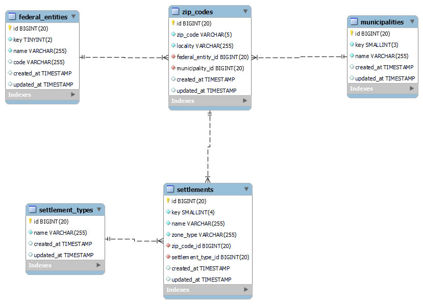
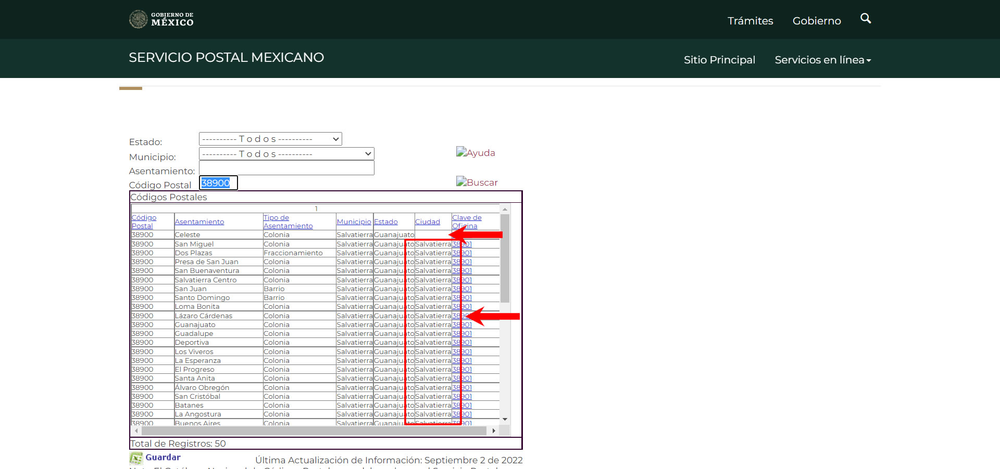
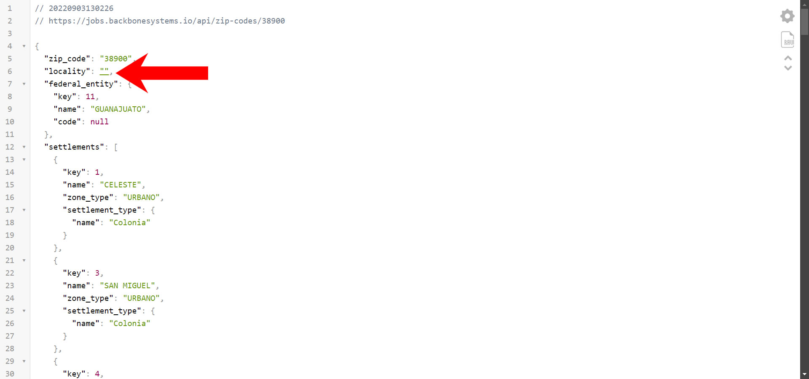
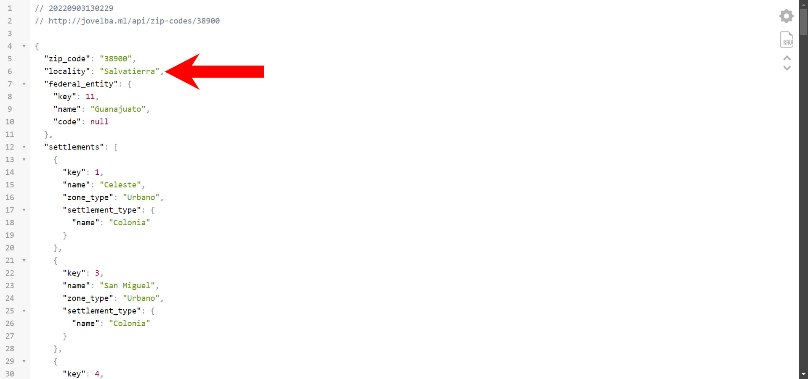
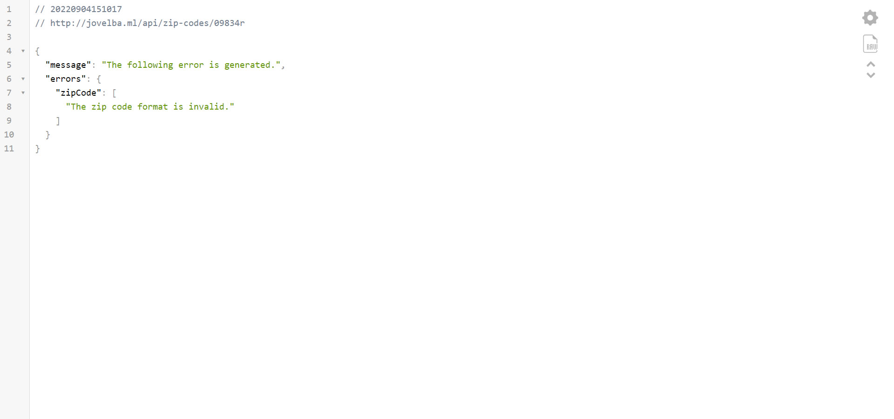
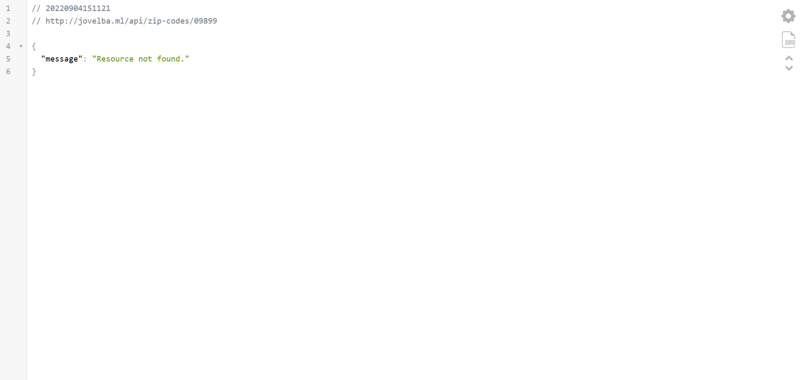

<br/>
<br/>

# Reto Técnico Backend Developer BackBoneSystems

<br/>
<br/>

## Tabla de contenido

<br/>
<br/>

1. [Autor.](https://github.com/jovel882/zipCodes/tree/feature/jovelba#black_nib-autor)

<br/>
<br/>

2. [Ambiente desplegado publico.](https://github.com/jovel882/zipCodes/tree/feature/jovelba#rocket-ambiente-desplegado-publico)

<br/>
<br/>

3. [Enfoque de la solución.](https://github.com/jovel882/zipCodes/tree/feature/jovelba#triangular_ruler-enfoque-de-la-soluci%C3%B3n)

<br/>
<br/>

4. [Desplegar.](https://github.com/jovel882/zipCodes/tree/feature/jovelba#airplane-desplegar)

<br/>
<br/>

## :black_nib: Autor.

<br/>
<br/>

**John Fredy Velasco Bareño** [jovel882@gmail.com](mailto:jovel882@gmail.com)

<br/>
<br/>

Se desarrollos la solución cumpliendo con los requisitos generales y adicionando otros detallados en la sección del **Enfoque de la solución.**.

<br/>
<br/>

## :rocket: Ambiente desplegado publico.

<br/>
<br/>

Se desplego sobre este DNS [jovelba.ml](http://jovelba.ml/api/zip-codes/01210) la solución.

<br/>
<br/>

## :triangular_ruler: Enfoque de la solución.

<br/>
<br/>

Mi enfoque para dar solución al [reto](https://jobs.backbonesystems.io/challenge-fullstack.pdf) lo hice de la siguiente manera:

<br/>
<br/>

> :bulb: Toda la solución se desarrollo sobre Laravel **`9.26.1`** la mas reciente disponible a la fecha de su elaboración.

<br/>
<br/>

+ Inicie revisando la forma de publicar la solución, luego de revisar y sopesar opciones decidí usar AWS con un servicio EC2 que seria mas que suficiente. El uso de AWS represento el mayor reto ya que nunca lo había usado y era lo que mas desconocía dentro de todo este proceso de desarrollo de la solución.

<br/>
<br/>

+ Indague la fuente de datos en búsqueda de algún tipo de endpoint referente a algún API para poder consultar la data y poder usarla en la solución. Lastimosamente no la encontré.

<br/>
<br/>

+ Debido a que no había algún tipo de integración posible baje el archivo plano en TXT disponible en el sitio.

<br/>
<br/>

+ En primera instancia evalúa la posibilidad de cargar la data tal cual a un único modelo en un motor de BD no relacional para mejorar el rendimiento, pero la desestime principalmente porque no tengo experiencia en este tipo de modelos y motores no relacionales. 

	<br/>
	<br/>

	Finalmente opte por crear un un modelo relacional para poder darle mas organización al modelo pensando en una administración y optimizar los tiempos a nivel de BD con índices en las tablas y en la creación de las consultas.

<br/>
<br/>

+ Empecé a trabajar en el modelo de BD que me permitiera poder organizar los datos que fuese funcional y sobre todo mejorar el rendimiento.

	<br/>
	<br/>

	+ El modelo resultante es el siguiente.

		<br/>
		<br/>

		

		<br/>
		<br/>

	+ A nivel de datos trate de mantener los datos lo mas posible fiel a la fuente es por ello que:

		<br/>
		<br/>

		+ El API no entrega los caracteres en mayúsculas como en el de referencias.
		
		<br/>
		<br/>

		+ Se encontraron y ajustaron algunos asentamientos que en el campo de nombre **"d_ciudad"** en la fuente y que en el API de ejemplo se entrega en **"locality"** un vacío. En un solo asentamiento esta vacío pero en los demás si cuenta con datos. Un ejemplo puntual se puede ver directamente en la fuente en el siguiente [enlace](https://www.correosdemexico.gob.mx/SSLServicios/ConsultaCP/Descarga.aspx) ingresando el Código Postal **`38900`**.
		
			<br/>
			<br/>

			
			
			<br/>
			<br/>

			> :pushpin: En este ejemplo se ve que el asentamiento **"Celeste"** no tiene dato en el campo de **"Ciudad"**. Pero en los demás asentamientos si cuenta con el valor de **"Salvatierra"**
		
			<br/>
			<br/>		

			

			<br/>
			<br/>

			> :pushpin: En el Api de referencia el resultado es este.

			<br/>
			<br/>

			

			<br/>
			<br/>

			> :pushpin: En el Api desarrollado el resultado es este.

			<br/>
			<br/>

	+ Para la carga de los datos a la BD se usaron generadores para poder cargar los datos desde archivos Json en los Seeders debido a que cuentan con bastantes líneas y procesarlas de una manera normal causaría un retraso importante o de lleno no poder procesarlos.


		<br/>
		<br/>

		El archivo mas grande **[settlements.json](https://github.com/jovel882/zipCodes/blob/master/database/seeders/jsonData/settlements.json)** cuenta con **8.499.393** líneas y un peso de **26,3 MB**. 

		<br/>
		<br/>		

		Idealmente se podría cargar un backups directo a la BD desde un archivo SQL pero generaría más necesidades dentro del despliegue y complicando la automatización del mismo.
		
	<br/>
	<br/>

	+ Se crearon los modelos con todas sus relaciones.

	<br/>
	<br/>

	+ Se crearon los seeder mencionados anteriormente dejando la opción para el ambiente de test de usar los Factories y no los archivos Json definitivos.

	<br/>
	<br/>

	+ Se crearon los Model Factories correspondientes a cada modelo para su uso.

	<br/>
	<br/>	

+ Cree la ruta y controlador para buscar y retornar el ZipCode con la estructura indicada. A descartar en este aspecto
	
	<br/>
	<br/>

	+ Validaciones en ruta y controlador para que el parámetro recibido cumpla con el patrón necesario.

	<br/>
	<br/>

	+ Trate de dar una estructura en las respuestas mas encaminada a la respuesta normal de un API.

		<br/>
		<br/>

		+ Retornamos un estado 422 cuando la validación del tipo de ZipCode no es el apropiado junto con el mensaje correspondiente.

			<br/>
			<br/>

			

			<br/>
			<br/>

		+ Retornamos un estado 404 cuando no se encuentra el ZipCode ingresado con el mensaje correspondiente.

			<br/>
			<br/>

			

			<br/>
			<br/>

+ Se crearon pruebas automatizadas funcionales y unitarias para validar el correcto funcionamiento de la solución.

	<br/>
	<br/>

	+ La funcional valida que toda la interacción se complete y se obtenga la respuesta correcta del ZipCode.

	<br/>
	<br/>

	+ Las unitarias verifican los diversos flujos dentro de la solicitud de los ZipCodes como validaciones y respuesta final usando Mocks y Stubs para simular objetos y funciones para aislar las funcionalidades.

	<br/>
	<br/>

+ Para aumentar el rendimiento se dispuso el uso de laravel Octane con el servidor Swoole para mejorar el tiempo de respuesta al tener dispuesto la estructura básica del Framework precargada con en el primer acceso.

<br/>
<br/>

+ Cree una imagen de **[Docker](https://hub.docker.com/r/jovel882/zip-code/tags)** alojada en el registry de dockerhub con todo ya dispuesto para obtener un ambiente totalmente funcional de la solución, mas un archivo **"Docker Compose"** y su archivo **".env"** para facilitar el despliegue: Estos últimos incluidos en este repo sobre la raíz en la carpeta [Docker](https://github.com/jovel882/zipCodes/tree/master/Docker).

<br/>
<br/>

+ Finalmente monte la solución en una instancia EC2 en AWS con Cloudflare como CDN.

<br/>
<br/>

## :airplane: Desplegar.

<br/>
<br/>

+ Prerrequisitos

	<br/>
	<br/>

	+ **Docker >= 20.\***

	<br/>
	<br/>

	+ **Docker Compose >=2.\***

	<br/>
	<br/>

+ Pasos

	<br/>
	<br/>

	> :bulb: Si esta sobre algún sistema basado en linux y ejecuta la siguiente linea se iniciara un ambiente totalmente funcional sobre el DNS [jovelba.ml](http://jovelba.ml/api/zip-codes/01210).

	<br/>
	<br/>

	```sh

	git clone -b master --single-branch https://github.com/jovel882/zipCodes.git && cd zipCodes && rm -Rf !(Docker) .[^.]* && mv Docker/* Docker/.[^.]* . && rm -fR Docker && mv .env.example .env && docker compose -f docker-compose.yml up -d && docker logs -f zip_codes

	```

	<br/>
	<br/>

	+ Baje los archivos necesarios del repo, para esto puede usar alguna de estas dos opciones:

		<br/>
		<br/>

		+ Si esta en algún sistema basado en linux ejecute esta linea.

			<br/>
			<br/>

			```sh

			git clone -b master --single-branch https://github.com/jovel882/zipCodes.git && cd zipCodes && rm -Rf !(Docker) .[^.]* && mv Docker/* Docker/.[^.]* . && rm -fR Docker && mv .env.example .env

			```

			<br/>
			<br/>

			> :pushpin: Este comando baja la rama master del repo y deja solo el contenido del folder **"Docker"** con los archivos **"docker-compose.yml"** y el archivo **".env"** dentro de un folder **"zipCodes"** en la raíz de la carpeta donde se ejecute el comando.

			<br/>
			<br/>

		+ Baje cada uno de los archivos y guárdelos en un mismo folder.

			<br/>
			<br/>

			+ [docker-compose.yml](https://raw.githubusercontent.com/jovel882/zipCodes/master/Docker/docker-compose.yml). Descárguelo y guárdelo con el nombre de **"docker-compose.yml"**.

			<br/>
			<br/>

			+ [.env.example](https://raw.githubusercontent.com/jovel882/zipCodes/master/Docker/.env.example). Descárguelo y guárdelo con el nombre de **".env"**.

			<br/>
			<br/>

	+ Ajuste las variables de entorno de acuerdo al resultado deseando del ambiente.

		<br/>
		<br/>

		> :mega: Si no edita ninguna variable se iniciara un ambiente totalmente funcional sobre el DNS [jovelba.ml](http://jovelba.ml/api/zip-codes/01210).

		<br/>
		<br/>

		+ Variables dentro del archivo **".env"**.

			<br/>
			<br/>

			+ `COMPOSE_PROJECT_NAME` (\*Requerido): Es el nombre con el que se creara el proyecto de Docker Compose.

			<br/>
			<br/>

			+ `BD_CONTAINER_NAME` (\*Requerido): Es el nombre del contenedor con el motor de BD que se levanta y donde se conectara la solución de Laravel.

			<br/>
			<br/>

			+ `PORT_BD` (\*Requerido): Es el puerto del motor de BD que se levanta y donde se conectara la solución de Laravel.

			<br/>
			<br/>

			+ `MYSQL_DATABASE` (\*Requerido): Es el nombre de la BD que se creara si no existe ya en el motor de BD que se levanta y a la que se conectara la solución de Laravel.

			<br/>
			<br/>

			+ `MYSQL_ROOT_PASSWORD` (\*Requerido): Es la contraseña que se le asigna al usuario root del motor de BD que se levanta y donde se conectara la solución de Laravel.

			<br/>
			<br/>

			+ `GIT_BRANCH` (\*Requerido): Es el nombre de la rama del repo que se usara para levantar la solución de Laravel.

			<br/>
			<br/>

		+ Variables dentro del archivo **"docker-compose.yml"**.

			<br/>
			<br/>

			+ Dentro del servicio de nombre **"zip_codes"** en la sección de **"environment"**

				<br/>
				<br/>

				+ `VIRTUAL_HOST` (\*Requerido): Define el nombre del DNS sobre el que se levantara la solución de Laravel.
					
				<br/>
				<br/>

	+ Ejecute el docker-compose.yml para levantar el ambiente.
	
		<br/>
		<br/>

		```sh

		docker compose -f docker-compose.yml up -d

		```

		<br/>
		<br/>

	+ Siga el estado del despliegue del contenedor principal con la siguiente comando.

		<br/>
		<br/>

		```sh

		docker logs -f zip_codes

		```
		<br/>
		<br/>

		> :pushpin: En este logs si todo esta correcto podrá ver la clonación del repo, instalación de paquetes con Composer, la optimización de archivos, la ejecución de las migraciones, la ejecución de los Seeders, la creación del servicio con Octane, las ejecución/resultado de pruebas y finalmente el inicio de los servicios del servidor web con Supervisor entre otros.
<br/>
<br/>